# StableSwap MNT/stMNT Protocol

> A yield-generating stable swap AMM with integrated staking strategy for MNT tokens

[](https://opensource.org/licenses/MIT)
[](https://solidity.readthedocs.io/)
[](https://openzeppelin.com/)

## 📋 Table of Contents

- [Overview](#overview)
- [Key Features](#key-features)
- [Architecture](#architecture)
- [Smart Contracts](#smart-contracts)
- [Security Features](#security-features)
- [Getting Started](#getting-started)
- [Usage Examples](#usage-examples)
- [Testing](#testing)
- [Security Considerations](#security-considerations)
- [License](#license)

## 🎯 Overview

The StableSwap MNT/stMNT Protocol is a sophisticated DeFi primitive that combines:

- **Stable Swap AMM**: Curve-style low-slippage trading between MNT and stMNT tokens
- **Yield Strategy**: Automated staking of idle MNT to generate additional returns
- **Security Extensions**: MEV protection, rate limiting, and emergency controls

The protocol enables users to trade between MNT and stMNT with minimal slippage while automatically generating yield on deposited assets through an integrated staking strategy.

## ✨ Key Features

### 🔄 Stable Swap AMM
- **Low Slippage Trading**: Curve-style invariant optimized for stable assets
- **Efficient Price Discovery**: Automated market making with concentrated liquidity
- **Balanced Liquidity**: Proportional and single-sided liquidity provision

### 📈 Integrated Yield Strategy
- **Automated Staking**: Idle MNT tokens are automatically staked to earn stMNT rewards
- **Yield Distribution**: Generated profits are shared with all liquidity providers
- **Capital Efficiency**: Maximizes returns on deposited assets

### 🛡️ Advanced Security
- **MEV Protection**: Locked profit degradation prevents sandwich attacks
- **Rate Limiting**: Cooldown periods mitigate flash loan attacks  
- **Emergency Controls**: Multi-layered pause and recovery mechanisms
- **Access Control**: Role-based permissions with separation of concerns

### 🏛️ Governance & Management
- **Decentralized Governance**: Community-controlled parameter updates
- **Strategy Management**: Flexible strategy deployment and migration
- **Performance Monitoring**: Comprehensive health checks and reporting

## 🏗️ Architecture

```mermaid
graph TB
    Users[👥 Users] --> Pool[🏊 StableSwap Pool]
    Pool --> Strategy[📈 StrategyStMnt]
    Strategy --> Vault[🏛️ stMNT Vault]
    
    Pool --> |30% Buffer| MNT[💰 MNT Tokens]
    Pool --> |70% Invested| Strategy
    Strategy --> |Stake| Vault
    Vault --> |Rewards| Strategy
    Strategy --> |Profits| Pool
    
    Security[🛡️ Security Extensions] --> Pool
    Governance[🏛️ Governance] --> Pool
    Governance --> Strategy
```



### Core Components

1. **StableSwap Pool**: Main AMM contract handling trades and liquidity
2. **Strategy Contract**: Yield generation through MNT staking
3. **Security Extensions**: MEV protection and safety mechanisms
4. **Interfaces**: Type-safe contract interactions

## 📄 Smart Contracts

### Core Contracts

| Contract | Description | Key Functions |
|----------|-------------|---------------|
| `StableSwap.sol` | Main AMM pool contract | `swap()`, `addLiquidity()`, `removeLiquidity()` |
| `StrategyStMnt.sol` | Yield strategy implementation | `invest()`, `harvest()`, `poolCallWithdraw()` |
| `StableSwapSecurityExtensions.sol` | Security mechanisms | `_calculateLockedProfit()`, `_updateLockedProfit()` |

### Interfaces

| Interface | Purpose |
|-----------|---------|
| `IStableSwap.sol` | StableSwap contract interface |
| `IStrategyStMnt.sol` | Strategy contract interface |
| `IVault.sol` | External staking vault interface |

### Key Parameters

| Parameter | Value | Description |
|-----------|-------|-------------|
| Amplification Coefficient (A) | 1000 | Controls curve flatness |
| Swap Fee | 0.03% | Base trading fee |
| Liquidity Fee | 0.015% | Imbalanced liquidity fee |
| Boost Fee | 30% | Performance fee from strategy |
| Cooldown Period | 1 hour | Rate limiting for major operations |
| Locked Profit Degradation | ~6 hours | MEV protection duration |

## 🛡️ Security Features

### MEV Protection
- **Locked Profit Degradation**: New profits are gradually unlocked over ~6 hours
- **Virtual Price Stability**: Prevents value extraction during harvest operations
- **Sandwich Attack Mitigation**: Price impact protection during yield distribution

### Rate Limiting
- **Cooldown Periods**: Minimum time between major operations per user
- **Flash Loan Protection**: Prevents rapid-fire attack patterns
- **Operation Throttling**: Configurable limits on operation frequency

### Emergency Controls
- **Multi-Level Pausing**: Granular control over different protocol functions
- **Emergency Withdrawal**: Complete strategy exit and fund recovery
- **Guardian System**: Rapid response capability for critical issues

### Access Control
- **Role-Based Permissions**: Hierarchical access control system
- **Separation of Concerns**: Different roles for different functions
- **Multi-Signature Support**: Compatible with multi-sig governance

## 🚀 Getting Started

### Prerequisites

- Node.js >= 16.0.0
- Foundry/Forge for development
- Git for version control

### Installation

```bash
# Clone the repository
git clone https://github.com/your-org/stableswap-mnt-stmnt.git
cd stableswap-mnt-stmnt

# Install dependencies
npm install

# Install Foundry dependencies
forge install
```

### Compilation

```bash
# Compile contracts
forge build

# Run tests
forge test

# Run tests with gas reporting
forge test --gas-report
```

### Deployment

```bash
# Deploy to local network
forge script script/Deploy.s.sol --rpc-url http://localhost:8545 --broadcast

# Deploy to testnet
forge script script/Deploy.s.sol --rpc-url $TESTNET_RPC_URL --broadcast --verify
```

## 💡 Usage Examples

### Basic Trading

```solidity
// Swap MNT for stMNT
uint256 amountOut = stableSwap.swap(
    0,                    // MNT index
    1,                    // stMNT index  
    1000 ether,          // Amount to swap
    950 ether            // Minimum output (5% slippage)
);
```

### Liquidity Provision

```solidity
// Add balanced liquidity
uint256 shares = stableSwap.addLiquidity(
    [1000 ether, 1000 ether],  // MNT and stMNT amounts
    1900 ether                  // Minimum LP tokens
);

// Remove liquidity proportionally
uint256[2] memory amounts = stableSwap.removeLiquidity(
    shares,                     // LP tokens to burn
    [900 ether, 900 ether]     // Minimum outputs
);
```

### Single-Sided Operations

```solidity
// Add single-sided liquidity (MNT only)
uint256 shares = stableSwap.addLiquidity(
    [2000 ether, 0],           // Only MNT
    1800 ether                 // Minimum LP tokens
);

// Withdraw single token
uint256 mntOut = stableSwap.removeLiquidityOneToken(
    shares,                    // LP tokens to burn
    0,                        // MNT index
    1800 ether                // Minimum MNT output
);
```

## 🧪 Testing

The protocol includes comprehensive test suites covering:

### Core Functionality Tests
- AMM mathematics and invariant checks
- Liquidity operations and edge cases
- Strategy integration and yield distribution

### Security Tests
- Access control verification
- MEV protection validation
- Emergency procedure testing
- Rate limiting verification

### Integration Tests
- End-to-end user flows
- Strategy coordination
- Governance operations

### Running Tests

```bash
# Run all tests
forge test

# Run specific test files
forge test --match-path test/StableSwap.t.sol

# Run with detailed output
forge test -vvv

# Generate coverage report
forge coverage
```

## ⚖️ License

This project is licensed under the MIT License - see the [LICENSE](LICENSE) file for details.

## 🙏 Acknowledgments

- **Curve Finance**: Inspiration for stable swap mathematics
- **Yearn Finance**: Strategy pattern and yield optimization concepts
- **OpenZeppelin**: Security patterns and access control frameworks
- **Foundry**: Development and testing framework

---

**⚠️ Disclaimer**: This protocol is experimental software. Use at your own risk. Always do your own research before interacting with any DeFi protocol.